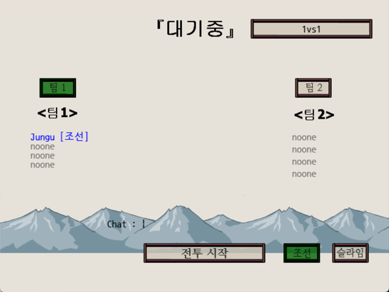
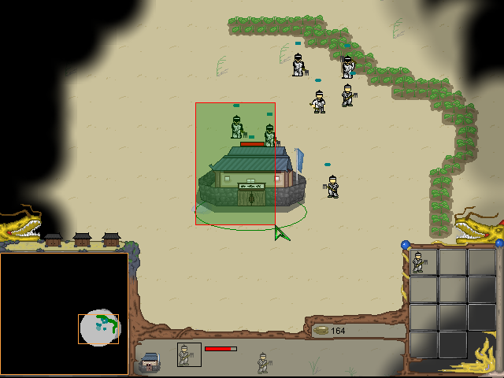

# 전설의신화2: 전쟁의서막

게임메이커 8로 만든 실시간 전략 게임이다. 조선과 슬라임 두 종족 중 하나를 골라 자원을 모으고 건물을 세우고 유닛을 뽑아 싸운다. 최대 2:2 멀티플레이와 관전을 지원하고, 컴퓨터를 상대로 혼자 할 수도 있다. 유닛의 능력치와 그림을 실행 파일 밖 텍스트·스프라이트 파일로 두어 파일만 고치면 유닛을 바꾸거나 새로 만들 수 있다. [전설의신화](https://github.com/wnsrn3436/game-myth-of-legend)의 후속작이다.

<p>


</p>


## 플레이 방법

Releases에서 받아 실행하면 된다. 첫 화면에서 방을 만들거나, IP 를 넣어 남의 방에 들어가거나, 혼자 즐기기를 고른다. 방은 12345 포트로 열리고, 들어갈 때 이름을 넣는다. 로비에서는 팀, 종족(조선·슬라임), 맵(1vs1·2vs2)을 고르고 채팅할 수 있으며, 전투 시작을 누르면 5초 뒤에 모두 함께 시작한다. 한 팀에 네 자리가 있고 맵에 시작 지점이 없는 자리는 관전이 된다. 혼자 즐기기는 종족과 컴퓨터 난이도(1~5)를 고른다.

| 조작 | 동작 |
|---|---|
| 마우스 왼쪽 드래그 | 유닛 선택 (한 번에 8기까지) |
| 유닛 더블클릭 | 근처의 같은 종류 유닛 선택 (8기까지) |
| 마우스 오른쪽 | 이동. 생산 건물 하나만 고른 상태면 집결지 지정 |
| A 누른 뒤 왼쪽 클릭 | 어택땅 |
| 1~9 | 생산 단축키. ESC 는 마지막 생산 취소 |
| Q | 일꾼 자원 채집 |
| 방향키, 화면 가장자리에 마우스 | 화면 이동 |
| Enter | 채팅. `!이름` 을 치면 선택한 유닛의 이름이 바뀐다 |
| 미니맵 | 왼쪽 드래그로 화면 이동, 오른쪽 클릭으로 이동 명령 |

혼자 즐기기에서는 채팅창에 `백만장자` 를 치면 자원 5000, `내눈을바라봐` 를 치면 안개가 걷힌다. 생산 대기열은 6개까지이고 자원을 캐는 일꾼은 체력이 조금씩 준다. 창병은 기병과 유전자에게, 기마궁병과 라임스트는 건물에 추가 공격력을 갖는다. 화면 이동 속도와 안개 품질은 `Options.ini` 에서 바꾼다.


## 구현 원리

**능력치와 그림이 실행 파일 밖에 있다.** 시작할 때 `Abilitys\<id>.txt` 를 전부 읽어 `key=value` 줄을 순서대로 `global.abilitys[id, n]` 에 넣고(이름 줄만 따로 둔다), 생산 비용, 생산 시간, 자원 반납 건물과 채집 시 체력 감소치를 적은 `Costs.txt`, `Times.txt`, `Moni_Go.txt` 는 GML 문장 그대로라 `execute_file` 로 실행한다. 유닛 그림은 `Sprites\<id>_<n>.gmspr` 를 `sprite_add_sprite` 로 읽어 붙인다. id 0부터 9까지가 조선, 100부터 111까지가 슬라임이다.

```gml
execute_file("Abilitys\Costs.txt")
execute_file("Abilitys\Times.txt")
execute_file("Abilitys\Moni_Go.txt")
```

그래서 파일만 고쳐 유닛을 바꾸거나 새로 만들 수 있다. 대신 실행 파일과 `Abilitys\`, `Sprites\` 의 파일을 전부 이어 붙인 MD5 를 접속 직후 방장의 값과 대조해, 다르면 메시지를 띄우고 게임을 끝낸다.

**멀티플레이는 행동을 복제한다.** 직접 만든 FN Simple Scripts v3.2 로 Faucet Networking 소켓을 감싸, 이동·공격·생산·피해 같은 행동마다 번호를 붙인 메시지를 보낸다. 유닛과 건물은 만들 때 방장을 거쳐 일련번호를 받고 모두에게 다시 뿌려지므로 모든 화면이 같은 유닛을 같은 번호로 가리킨다. 피해 계산은 공격하는 유닛의 주인이 하고 결과만 보내며, 컴퓨터 유닛 몫은 방장이 대신 한다. 컴퓨터 상대는 일꾼 생산, 유닛 생산, 건설, 공격 네 가지 알람으로 돌아가며 난이도는 알람 주기를 나누는 값이다.

**한글 출력과 입력을 엔진에 맡기지 않는다.** 게임메이커 8 은 한글을 제대로 그리지 못하고 조합 중인 글자도 받지 못한다. 그래서 출력은 스프라이트 폰트 스크립트로 글자를 그리고, 채팅 입력은 직접 만든 K-DLL 로 IME 의 조합 문자열을 읽는다. 전장의 안개는 `ds_grid` 에 시야를 찍어 화면 크기 서피스에 옮긴 뒤 빼기 블렌드로 덮는다.


## 파일

| 경로 | 내용 |
|---|---|
| `source/myth-of-legend-2.gmk` | 프로젝트 파일 |
| `source/split/` | GmkSplitter로 분해한 텍스트 트리 |
| `source/Abilitys/` | 유닛 능력치, 생산 비용·시간 텍스트 파일 |
| `source/Sprites/` | 유닛 스프라이트 (`<id>_<n>.gmspr`) |
| `source/Gex/` | 확장 패키지 |
| `source/ICO/` | 아이콘과 로딩 이미지 |
| `source/Options.ini` | 화면 이동 속도와 안개 품질 설정 |
| `old/2009-11-prototype/` | 엔진 시험판. 유닛 그림을 암호 걸린 zip 에서 읽는다 |
| `old/2009-12-planning/` | 안개 시연, 지형 에디터, 맵 에디터와 자작 dlrc 아카이브 설계 문서 |
| `old/2010-02-dongto-yeomyeong/` | 전작 동토의 여명. 39dll 멀티플레이 판의 소스와 v1.2 실행 파일 디컴파일본 |
| `docs/old-versions.ko.md` | 이전 판들의 계보 |
| Releases | 실행 파일과 데이터, 배경음악 |


## 크레딧

유닛 도트는 쉐라프(zizonpink)님이 그렸다. Faucet Networking은 Medo42, 39DLL은 39ster, Saudio는 andrewmc, Hashes Dll은 freaked, 한글 출력 스크립트(Sefx)는 김게맛(sodium031)님이 만들었다. 프로토타입의 zip 처리에는 gmZip.dll(`ml_uns.dll` 도 같은 파일)을 썼다. InstanceNearest, K-DLL, FN Simple Scripts, 39dll Simple Scripts 는 직접 만들었다.


## 라이선스

CC BY-NC-ND 4.0 라이선스다. 출처를 밝히면 비상업 용도로 그대로 공유할 수 있고, 수정본 배포와 상업적 이용은 금지한다. 함께 들어 있는 것 중 다른 사람이 만든 라이브러리와 그림·소리·맵은 각자의 권리를 따른다. 자세한 내용은 [LICENSE](LICENSE) 에 있다.
